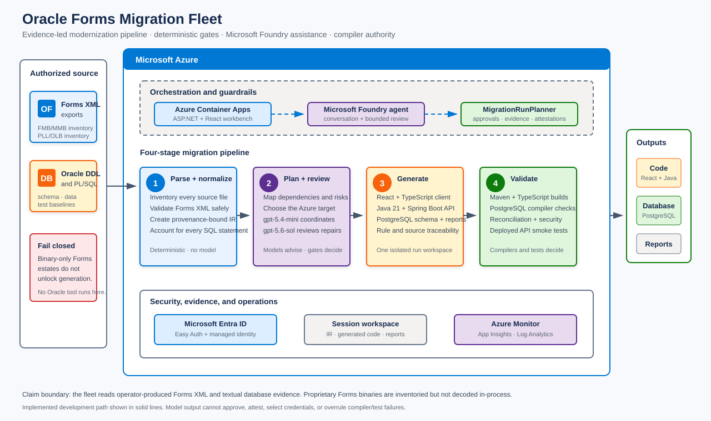
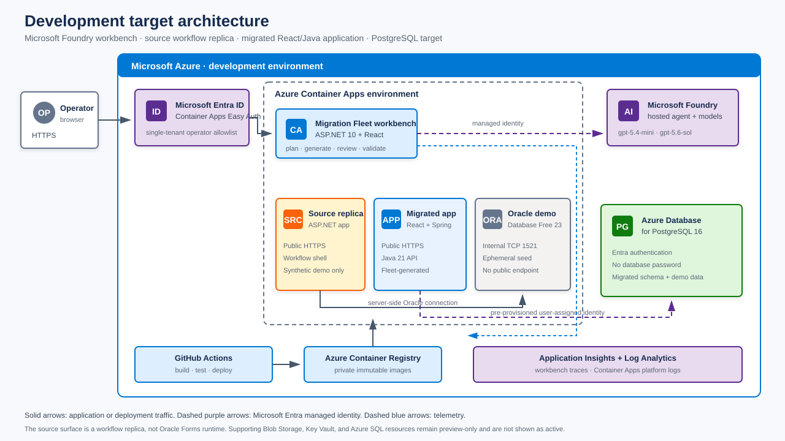

# Oracle Forms to React, Java, and PostgreSQL on Azure

A working sample for modernizing Oracle Forms applications with an evidence-led migration fleet on
Microsoft Azure. The fleet inventories and normalizes authorized source evidence, plans the migration,
generates a React and Java/Spring Boot application plus PostgreSQL artifacts, and validates the result
with compilers, database checks, reconciliation, deployed API smoke tests, and recorded browser acceptance.

> This repository is a development sample, not a universal Oracle Forms converter or production
> migration service. The live Northstar estate is synthetic. Review security, licensing, cost, and
> generated code before using any part of it with customer assets.

## Live demonstration

| Experience | URL | What it proves |
|---|---|---|
| Source workflow replica | <https://ca-ofmfleet-forms-dev-ykbpnrpd.jollyground-7a57bcec.eastus2.azurecontainerapps.io/> | The browser workflow and synthetic source data used for manual source/target comparison. It is not Oracle Forms runtime. |
| Migrated application | <https://ca-ofmfleet-mig-dev-ykbpnrpd.jollyground-7a57bcec.eastus2.azurecontainerapps.io/> | The fleet-generated React and Spring Boot workflow running against Azure Database for PostgreSQL 16. |

Synthetic demo identities:

| Role | User | Password |
|---|---|---|
| Customer | `500001` | `demo1234` |
| Manager | `branch.manager` | `manager-demo-1` |

## Overview

Organizations running Oracle Forms often need to recover decades of UI behavior, PL/SQL, data rules,
and integrations before they can replace the runtime safely. This sample demonstrates a bounded,
testable approach:

- **Inventory and normalize** Forms XML, module inventories, Oracle DDL, PL/SQL, data evidence, and
  regression baselines with deterministic parsers. Proprietary Forms binaries are never decoded by
  the hosted fleet.
- **Plan and review** dependencies, modernization waves, Azure targets, risks, and approvals with a
  Microsoft Foundry hosted agent backed by deterministic C# gates.
- **Generate** React/TypeScript, Java 21/Spring Boot, PostgreSQL DDL, migration reports, and tests into
  an isolated run workspace.
- **Validate** with TypeScript, Vite, Maven, Spring tests, PostgreSQL compilation, reconciliation, live API
  smoke tests, and browser acceptance. A model may propose a bounded repair; only compilers and tests accept it.

The model does not approve a migration, select credentials, attest execution, or override a failed gate.

## Architecture

**Migration pipeline**

[](docs/architecture-pipeline.svg)

Simplified editable concept: [docs/architecture-pipeline.excalidraw](docs/architecture-pipeline.excalidraw)

**Development target architecture**

[](docs/architecture-target.svg)

Simplified editable concept: [docs/architecture-target.excalidraw](docs/architecture-target.excalidraw)

## How it works

| Stage | Azure and fleet components | What it does |
|---|---|---|
| **1 · Parse and normalize** | .NET execution adapters · isolated session workspace | Inventories `.fmb`, `.mmb`, `.pll`, `.olb`, and text evidence; safely parses operator-produced Forms XML; binds source provenance into `forms-ir.json`; accounts for every Oracle SQL statement. Deterministic, no model. |
| **2 · Plan and review** | Microsoft Foundry hosted agent · `gpt-5.4-mini` · `gpt-5.6-sol` · `MigrationRunPlanner` | Maps dependencies and risks, recommends an Azure target from cited evidence, creates migration waves, and permits bounded review/repair proposals. Human approvals and deterministic gates remain authoritative. |
| **3 · Generate and migrate** | React/TypeScript emitter · Java 21/Spring Boot emitter · PostgreSQL converter | Produces the browser client, workflow API, converted schema, data-load artifacts, and traceable conversion reports. The recognized Northstar profile generates full banking workflows rather than generic CRUD. |
| **4 · Validate** | Maven · TypeScript/Vite · Spring tests · PostgreSQL · GitHub Actions | Compiles both application tiers, verifies database routines, reconciles data, runs deployed API smoke workflows, blocks unsafe generic endpoints, and requires explicit acceptance before cutover. |

The full lifecycle contains twelve independently gated phases, from source acquisition through
production cutover. `DifferentialBehaviorTesting` is defined and gated but has no execution adapter yet;
the recorded source/destination browser checks are manual acceptance evidence, not that phase. See
[docs/OPERATIONS.md](docs/OPERATIONS.md) for execution and rollback behavior.

## Prerequisites

For local build and deterministic tests:

- [.NET 10 SDK](https://dotnet.microsoft.com/download/dotnet/10.0)
- Node.js 22 and npm
- Git

For generated-application builds and Azure deployment:

- Java 21 and Maven 3.9+
- [Azure CLI](https://learn.microsoft.com/cli/azure/install-azure-cli)
- [Azure Developer CLI](https://learn.microsoft.com/azure/developer/azure-developer-cli/install-azd) 1.27.1+
- [GitHub CLI](https://cli.github.com/) for dispatching reviewed deployment workflows
- Docker, or permission to use Azure Container Registry Tasks
- An Azure subscription with permission to deploy resources and assign the narrowly scoped roles
  described in [infra/workbench/README.md](infra/workbench/README.md)

Oracle Forms Builder, Forms Services, WebLogic, and `ORACLE_HOME` are not bundled. Operators must run
licensed Oracle extraction or normalization tools in their own authorized environment.

## Quick start

Build the workbench client and run all offline tests:

```powershell
cd src/oracle-forms-migration-fleet/ClientApp
npm ci
npm run build
cd ../../..
dotnet restore
dotnet build --no-restore
dotnet test --no-build
```

Run the operator workbench locally:

```powershell
dotnet run --project src/oracle-forms-migration-fleet
```

Open <http://localhost:8088/>. Without Foundry configuration the deterministic workbench remains
available and model-backed requests return an explicit `503` instead of simulating a response.

Run the Forms 6i-through-12c textual pipeline matrix:

```powershell
dotnet test tests/oracle-forms-migration-fleet.Tests/oracle-forms-migration-fleet.Tests.csproj `
  --filter "FullyQualifiedName~A_text_export_from_each_intake_family_reaches_strict_ir_and_application_generation"
```

The five rows cover 6i, 9i, 10g, 11g, and 12c version declarations over a common synthetic XML
shape. They prove normalization-to-generation regression coverage, not native binary or runtime compatibility.

## Deploy

Deploy the Microsoft Foundry hosted agent declared in [azure.yaml](azure.yaml):

```powershell
azd auth login
azd deploy
```

Deploy the authenticated Azure Container Apps workbench from the GitHub runner. The runner builds and
tags the image from the commit, authenticates to Azure with OIDC, and updates the Container App:

```powershell
gh workflow run deploy.yml --repo rxt64/oracle-forms-migration-fleet -f migrate-data=true
```

The workflow also runs automatically after a reviewed change reaches `main`. The repository's GitHub
Actions workflows build, test, publish immutable images to ACR, deploy the workbench and migrated demo,
and run live workflow verification. Infrastructure preview and break-glass operational scripts are
documented in [docs/OPERATIONS.md](docs/OPERATIONS.md); deployable images are built by CI, not a workstation.

## What gets deployed

| Component | Azure service | Purpose |
|---|---|---|
| Migration fleet agent | Microsoft Foundry hosted agent | Conversation and tool coordination over the deterministic fleet. |
| Operator workbench | Azure Container Apps | Entra-protected ASP.NET 10 and React interface for planning and authorized execution. |
| Container images | Azure Container Registry | Private images pulled with managed identity; registry admin access is disabled. |
| Authentication | Microsoft Entra ID · Container Apps Easy Auth | Single-tenant operator authentication and allowlisting. |
| Workload identity | User-assigned managed identities | ACR pull, Foundry Agent Consumer, and pre-provisioned destination PostgreSQL authentication without database passwords. |
| Observability | Application Insights · Log Analytics | Workbench traces and Container Apps platform logs. |
| Source demo | Azure Container Apps | Internal-only Oracle Database Free 23 plus a public ASP.NET workflow replica. |
| Migrated demo | Azure Container Apps · Azure Database for PostgreSQL 16 | React and Spring Boot replacement using PostgreSQL as the data path. |

The optional [infra/supporting](infra/supporting) stack previews Blob Storage, Key Vault, and Azure SQL
foundations. Those resources are not presented as active migration dependencies until an adapter uses them.

## Sample legacy application

The included Northstar scenario is a legally clean, independently implemented banking demonstration:

- Synthetic Oracle schema, PL/SQL, and seed data in [infra/legacy-estate](infra/legacy-estate).
- Browser-executable source workflow replica in [src/oracle-forms-demo](src/oracle-forms-demo).
- Fleet-generated migrated application in [demo/northstar-migrated](demo/northstar-migrated).
- Customer and manager workflows for account requests, approval, registration, login, statements,
  transactions, and interest calculation.

The demonstrated path is a hand-authored Oracle Forms `12.2.1.4`-style XML fixture backed by Oracle
Database Free 23, migrated to Azure Database for PostgreSQL 16. It is not an export from a licensed
Forms runtime. Exact evidence and limits are in [docs/COMPATIBILITY.md](docs/COMPATIBILITY.md).

## Project structure

```text
src/oracle-forms-migration-fleet/   ASP.NET/React workbench, Foundry host, and deterministic fleet
  ClientApp/                        React and TypeScript operator interface
  Fleet/                            Planning, evidence, version, risk, and approval contracts
  Fleet/Execution/                  Source, code, database, build, migration, and validation adapters
  Hosting/                          Workspaces, build gateway, and workbench endpoints
src/oracle-forms-demo/              Source banking workflow replica over the synthetic Oracle database
demo/northstar-migrated/            Generated React + Java/Spring Boot destination
infra/workbench/                    ACR, identity, Entra auth, telemetry, and workbench Container App
infra/legacy-estate/                Disposable Oracle Database Free 23 source demo
infra/forms-demo/                   Source workflow replica deployment
infra/northstar-migrated/           Migrated application deployment
infra/supporting/                    Preview-only destination foundations
docs/                               Security, operations, compatibility, research, and diagrams
tests/                              Offline unit, integration, generation, and regression tests
.github/workflows/                  CI and Azure deployment workflows
```

## Security

- The browser receives no Azure token, Foundry endpoint, Oracle credential, or PostgreSQL credential.
- Container Apps calls Foundry and PostgreSQL with managed identity and least-privilege RBAC.
- Structured inputs and chat prompts that resemble credential material are rejected before model calls.
- Workspace paths reject rooted paths, UNC paths, URIs, traversal, drive prefixes, and alternate streams.
- Forms XML parsing disables DTDs and external resolution and enforces the Oracle Forms namespace.
- Model-generated routine repairs cannot change signatures or envelopes and are accepted only after
  PostgreSQL compiles them.
- Sandbox execution, human acceptance, and production cutover require separate approvals and artifacts.

Read [docs/SECURITY.md](docs/SECURITY.md) before connecting customer source or changing authentication.

## Cost

The development environment uses billable Microsoft Foundry model capacity, Azure Container Apps,
Azure Container Registry, Azure Database for PostgreSQL, Application Insights, and Log Analytics.
The Oracle demo database is the largest continuously running Container App. Scale demo resources to
zero when idle and monitor ingestion/model usage. Exact commands are in the infrastructure READMEs.

## Cleanup

There is intentionally no repository-wide destroy command because the resource group contains shared
Foundry and Container Apps resources. Use the targeted teardown sections in:

- [infra/forms-demo/README.md](infra/forms-demo/README.md)
- [infra/legacy-estate/README.md](infra/legacy-estate/README.md)
- [infra/workbench/README.md](infra/workbench/README.md)

Preview Bicep changes before deletion and preserve resources shared by the source and destination demos.

## Troubleshooting

- **A workbench request returns 504:** the workbench stays warm at one replica; inspect revision health,
  startup logs, Easy Auth, and traffic weight rather than treating it as a cold start.
- **A route briefly returns 404 after deployment:** traffic may still be switching between revisions.
- **Browser shows an old UI:** disable browser cache; the Vite bundle uses fixed asset names.
- **ACR build appears successful with `--no-logs`:** query the ACR run status explicitly.
- **Foundry returns 429:** retry after capacity is available; never treat a missing review as success.
- **Generated app does not build:** Java 21, Maven, Node, and npm are required; missing tools fail the phase.
- **Binary-only estate is refused:** supply complete operator-produced Forms XML for every module or add
  an isolated, licensed extraction worker. The hosted fleet does not decode `.fmb` files.

See [docs/OPERATIONS.md](docs/OPERATIONS.md) for the full runbook.

## Compatibility

| Evidence path | Current status |
|---|---|
| Forms 6i, 9i, 10g, 11g, 12c versioned synthetic XML | Normalization-to-generation matrix passes in CI. |
| Forms 12.2.1.4-style Northstar synthetic path | Generated, compiled, deployed, and browser-validated. |
| Native `.fmb`, `.mmb`, `.pll`, `.olb` extraction | Not implemented in the hosted process; binary-only estates fail closed. |
| General release-wide Forms compatibility | Not claimed until authorized representative projects pass extraction, compilation, deployment, and differential tests. |

Research for an isolated NDAPI worker and an optional ASP.NET Core/Blazor target is documented in
[docs/NDAPI_DOTNET_FEASIBILITY.md](docs/NDAPI_DOTNET_FEASIBILITY.md). Forms 6i normalization and upgrade
constraints are documented in [docs/ORACLE_FORMS_6I_RESEARCH.md](docs/ORACLE_FORMS_6I_RESEARCH.md).

## Innovation highlights

This project combines migration automation with evidence controls that prevent generated output from
being mistaken for a completed migration:

- **Deterministic source truth:** safe Forms XML parsing, directory-qualified module identities,
  provenance-bound intermediate representation, and complete Oracle statement accounting run before
  any model-assisted work.
- **Version-aware legacy intake:** Forms 6i through 12c textual exports share an executable CI matrix,
  while binary-only estates fail closed instead of producing guessed screens.
- **Specialist fleet with bounded AI:** Microsoft Foundry coordinates the workflow and reviews generated
  artifacts, but deterministic gates, human approvals, PostgreSQL compilation, and executable tests
  remain authoritative.
- **Source-shaped application generation:** recognized workflow profiles generate complete React and
  Java/Spring Boot experiences rather than exposing database tables as generic CRUD endpoints.
- **Passwordless Azure destination:** the migrated application uses a user-assigned managed identity to
  reach Azure Database for PostgreSQL without storing a database password.
- **Compiler-driven repair:** a model may propose body-only changes for rejected routines, but cannot
  change their signatures or surrounding DDL; PostgreSQL alone accepts or rejects each revision.
- **Reproducible delivery:** GitHub Actions builds commit-addressed images, validates the five-family
  matrix, compiles both generated application tiers, deploys through OIDC, and verifies live workflows.
- **Demonstrable before and after:** the source workflow replica and migrated PostgreSQL application are
  both live, use synthetic data, and expose the same customer and manager journeys for acceptance review.

## Documentation

| Document | Purpose |
|---|---|
| [docs/COMPATIBILITY.md](docs/COMPATIBILITY.md) | Demonstrated versions, textual matrix, and claim boundaries. |
| [docs/SECURITY.md](docs/SECURITY.md) | Threat model, identity, source handling, and non-negotiable guardrails. |
| [docs/OPERATIONS.md](docs/OPERATIONS.md) | Deployment, verification, rollback, and failure modes. |
| [docs/ORACLE_FORMS_6I_RESEARCH.md](docs/ORACLE_FORMS_6I_RESEARCH.md) | Forms 6i source recovery and upgrade path. |
| [docs/NDAPI_DOTNET_FEASIBILITY.md](docs/NDAPI_DOTNET_FEASIBILITY.md) | Isolated native extraction and .NET target feasibility. |
| [CONTRIBUTING.md](CONTRIBUTING.md) | Development and pull-request workflow. |
| [CHANGELOG.md](CHANGELOG.md) | Behavior and release history. |

## License and provenance

This repository currently has no root license file; do not assume redistribution rights beyond your
organization's authorization. Third-party products, packages, images, and source estates remain under
their own licenses. Oracle Forms and WebLogic binaries are proprietary and are not redistributed here.